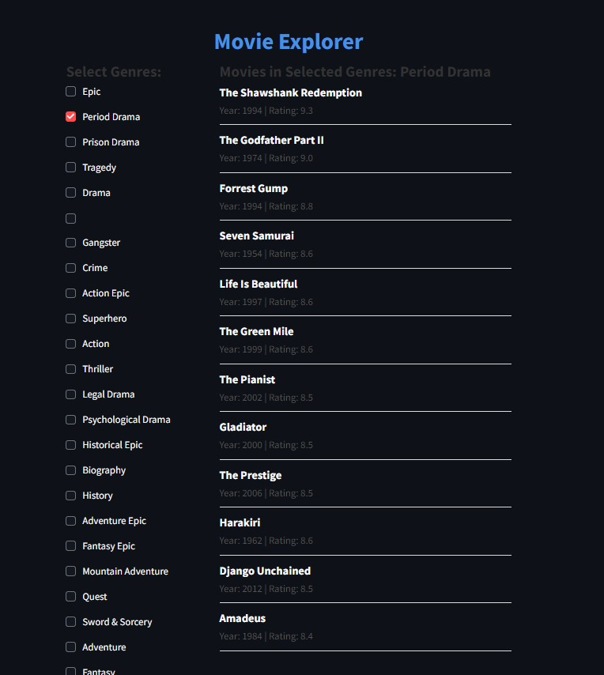

# IMDB Top Movies Scraper

 <!-- Custom Image -->

This project scrapes the IMDb (Internet Movie Database) website to retrieve information about the top movies and exports the data to an Excel file. It uses Selenium for web automation, BeautifulSoup for parsing HTML, and pandas for data manipulation.

## Features

- Scrapes the top movies from the IMDb Top 250 list.
- Extracts movie titles, genres, ratings, and release years.
- Saves the extracted data into an Excel file.

## Requirements

- Python 3.x
- Google Chrome browser
- ChromeDriver
- Required libraries: Selenium, BeautifulSoup, Pandas, WebDriver Manager

## Installation

1. **Clone the repository:**
   ```sh
   git clone https://github.com/your-username/imdb-top-movies-scraper.git
   cd imdb-top-movies-scraper
   ```

2. **Set up a virtual environment (optional but recommended):**
   ```sh
   python -m venv venv
   source venv/bin/activate   # On Windows use venv\Scripts\activate
   ```

3. **Install the required libraries:**
   ```sh
   pip install -r requirements.txt
   ```

   Alternatively, manually install the libraries as follows:
   ```sh
   pip install selenium beautifulsoup4 pandas openpyxl webdriver-manager
   ```

## Usage

1. **Run the script:**
   ```sh
   python script.py
   ```

2. **Check the generated Excel file:** 
   The Excel file `movies.xlsx` containing the scraped movie data will be created in the same directory as the script.

## Code Overview

The main steps include:

1. **Configuration of Selenium:**
   ```python
   from selenium import webdriver
   from selenium.webdriver.chrome.service import Service
   from selenium.webdriver.chrome.options import Options
   from webdriver_manager.chrome import ChromeDriverManager

   options = Options()
   options.headless = True  # Run in headless mode (no browser window)
   driver = webdriver.Chrome(service=Service(ChromeDriverManager().install()), options=options)
   ```

2. **Retrieving the IMDb Top 250 page:**
   ```python
   url = 'https://www.imdb.com/chart/top/'
   driver.get(url)
   html = driver.page_source

   def get_soup(url):
       driver.get(url)
       html = driver.page_source
       return BeautifulSoup(html, 'html.parser')
   ```

3. **Parsing the HTML to extract movie URLs:**
   ```python
   soup = get_soup(url)

   ulTags = soup.find_all('ul')

   url_list = []

   for ulTag in ulTags:
       if ulTag.has_attr('class'):
           class_list = ulTag['class']
           if 'ipc-metadata-list' in class_list and 'compact-list-view' in class_list:
               aTags = ulTag.find_all('a')
               for aTag in aTags:
                   if aTag.has_attr('class'):
                       class_list = aTag['class']
                       if 'ipc-title-link-wrapper' in class_list:
                           url_list.append(aTag['href'])
   ```

4. **Extracting movie details and saving to a list:**
   ```python
   movies = []
   max = 10
   isAll = True
   i = 0

   for url in url_list:
       this_movie = {}
       soup = get_soup(f'https://www.imdb.com{url}')
       
       # Find and assign movie details
       # Append movie info to the movies list
       
       if i == max and not isAll:
           break
   ```

5. **Creating a DataFrame and saving to an Excel file:**
   ```python
   df = pd.DataFrame(movies)
   df.to_excel('movies.xlsx', index=False)
   ```

## License

This project is licensed under the MIT License - see the [LICENSE](LICENSE) file for details.

## Acknowledgements

- IMDb for providing the data.
- [Selenium](https://www.selenium.dev/) for browser automation.
- [BeautifulSoup](https://www.crummy.com/software/BeautifulSoup/) for parsing HTML.
- [Pandas](https://pandas.pydata.org/) for data manipulation.
- [WebDriver Manager](https://github.com/SergeyPirogov/webdriver_manager) for managing browser drivers.


